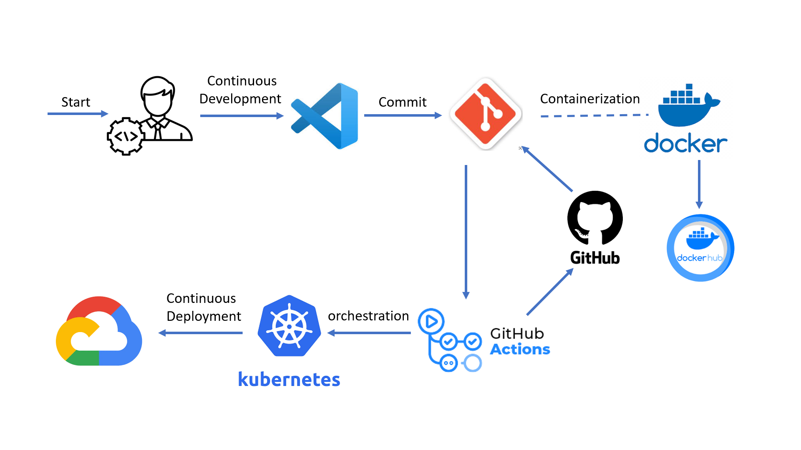

## Project  Overview

A railway ticket booking app is designed to provide users with a convenient, fast, and hassle-free experience for booking train tickets online. Such an app consolidates various services related to railway travel, including ticket reservations, cancellations, train schedules, live tracking, and customer support. These apps are used by passengers to plan and manage their journeys from anywhere, avoiding the need to visit physical railway stations. By integrating load balancing in a railway app's infrastructure, it ensures smooth performance, better user experience, and the ability to handle surges in traffic during high-demand times, ultimately providing a more reliable and scalable service for passengers.

This project utilizes `Jest, Github Actions, Open Telemetry tracing, Docker, Kubernetes and Google Cloud` for test automation, continuous integration and deployment.

## System Diagram
<p align='center'>

</p>

## Table of Contents

- [Prerequisites](#prerequisites)
- [Installation](#installation)
- [Usage](#usage)
- [Testing](#testing)
- [Continuous Integration and Deployment](#continuous-integration-and-deployment)
- [Frontend](#frontend)
- [Database](#database)
- [Continuous Monitoring](#continuous-monitoring)
- [Autoscaling with Kubernetes on Linode](#autoscaling-with-kubernetes-on-linode)
- [Contributing](#contributing)
- [Repository ](#repository)

## Prerequisites

Before getting started, ensure you have the following installed:

- Nest.js
- Git
- Docker
- Kubernetes (for deployment)

## Installation

To install the project locally, follow these steps:

1. Clone the repository:

```bash
git clone https://github.com/Sadatul/hackathon.git
cd hackathon
```

2. Install the dependencies:

```bash
npm install
```

## Usage

To run the project locally, execute the following command:

```bash
npm run dev
```

This will start the application and make it accessible at `http://localhost:3000`.


## Testing

This project uses [Jest](https://jestjs.io/) as the testing framework and [Supertest](https://www.npmjs.com/package/supertest) for making HTTP requests to test the API endpoints. The test code is located in the `tests` directory.

To run the tests, use the following command:

```bash
npm test
```

## Continuous Integration and Deployment

### GitHub Actions

This project utilizes [GitHub Actions](https://github.com/features/actions) for automating the CI/CD pipeline. The workflow files are located in the `.github/workflows` directory.

The CI/CD pipeline includes the following steps:


1. **Unit Testing**: The unit tests are executed using Jest to verify the correctness of the code.

2. **Build and Package**: The application is built and packaged into a Docker image.

3. **Containerization**: The Docker image is pushed to the container registry to be deployed on Kubernetes.

### Docker Deployment

To deploy the application using Docker and Kubernetes, follow these steps:

1. Build the Docker image:

```bash
docker build -t your-image-name .
```

2. Push the Docker image to a container registry of your choice:

```bash
docker push your-registry/your-image-name:tag
```

3. Deploy the application on Kubernetes:

```bash
kubectl apply -f deployment.yaml
```

Ensure that you have a valid `deployment.yaml` file with the necessary Kubernetes deployment configuration.

## Frontend

The frontend of this project is built using [Svelte](https://svelte.dev/). Svelte is a modern JavaScript framework that compiles your code to highly efficient JavaScript code during the build process. The frontend code is located in the `frontend` directory.

To develop the frontend, follow these steps:

1. Navigate to the frontend directory:

```bash
cd frontend
```

2. Install the frontend dependencies:

```bash
npm install
```

3. Run the frontend development server:

```bash
npm run dev
```

The frontend server will be accessible at `http://localhost:5000`.

## Database

This project uses [PostgreSQL](https://www.postgresql.org/) as the database. To set up the database, follow these steps:

1. Install MySQL on your local machine or use a hosted MySQL service.

2. Create a new database.

3. Configure the database connection in your project's configuration file.

```bash
# Example configuration
DB_HOST=localhost
DB_PORT=3306
DB_USER=your-username
DB_PASSWORD=your-password
DB_DATABASE=your-database
```

Ensure that you replace the placeholder values (`localhost`, `your-username`, `your-password`, `your-database`) with your actual database details.

## Continuous Monitoring

This project utilizes [Prometheus](https://prometheus.io/) and [Grafana](https://grafana.com/) for continuous monitoring. Prometheus is a monitoring and alerting toolkit, while Grafana is a visualization tool for analyzing and monitoring metrics.

To set up continuous monitoring, follow these steps:

1. Install and configure Prometheus for scraping and storing metrics.

2. Set up Grafana and configure it to connect to Prometheus as a data source.

3. Import predefined dashboards or create custom dashboards in Grafana to visualize the metrics collected by Prometheus.

By setting up continuous monitoring with Prometheus and Grafana, you can monitor the performance, health, and other metrics of your application in real-time.

## Autoscaling with Kubernetes on Google Cloud 

To handle autoscaling, this project utilizes Kubernetes on Google Cloud. Kubernetes provides a robust container orchestration platform, and Google Cloud offers a scalable infrastructure to host your Kubernetes cluster.

To set up autoscaling, follow these steps:

1. Create a Google Cloud Kubernetes cluster.

2. Configure the autoscaling parameters such as minimum and maximum replica counts, target CPU or memory utilization, and scaling policies.

3. Deploy your application to the Kubernetes cluster and configure the autoscaling rules based on your application's performance metrics.

Kubernetes will automatically adjust the number of replicas based on the defined autoscaling rules, allowing your application to scale up or down based on demand.

## Contributing

Contributions are welcome! If you find any issues or have suggestions for improvement, please open an issue or submit a pull request.

## Repository

All the repositories are as follow:
[gateway](https://github.com/Sadatul/hackathon_gateway),
[otp](https://github.com/Sadatul/hackathon_otp),
[authservice](https://github.com/Sadatul/hackathon_authservice),
[train_query](https://github.com/Sadatul/hackathon_train_query),
[booking_service](https://github.com/Sadatul/hackathon_booking_service),
[payment_service](https://github.com/Sadatul/hackathon_payment_service),
[booking](https://github.com/Sadatul/hackathon_booking),
[IaC](https://github.com/Sadatul/hacakathon_IaC),
[frontend](https://github.com/hasnainadil/hackathon-frontend24.git)


